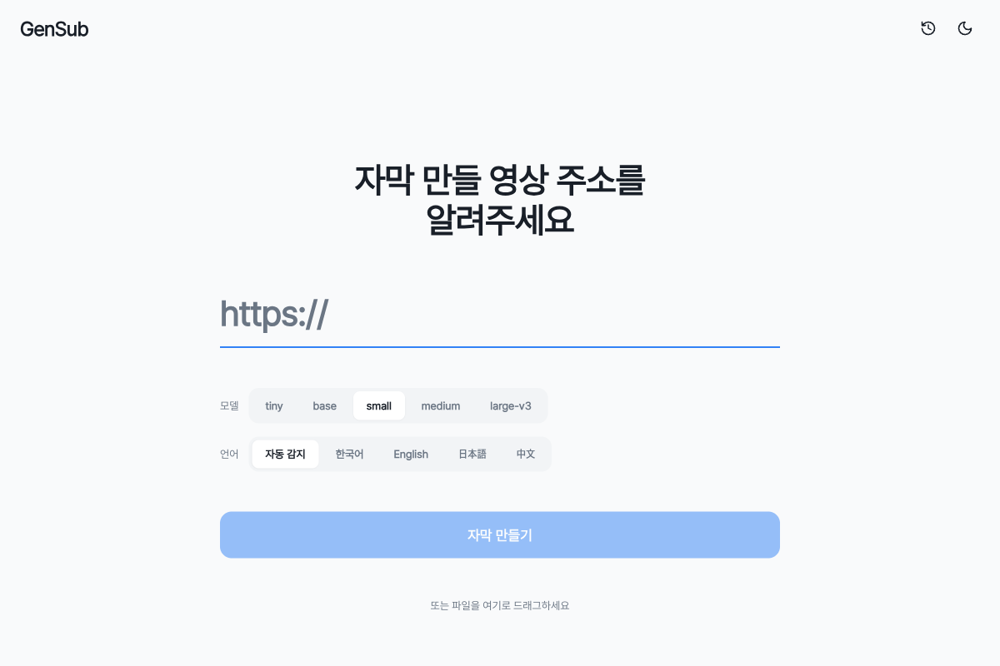
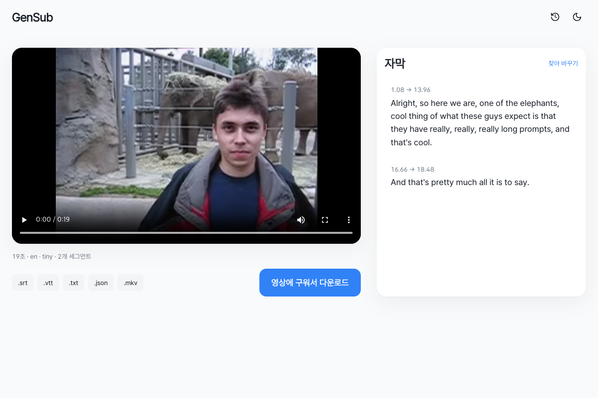

# GenSub

YouTube 영상이나 로컬 파일을 받아 **Whisper로 자막을 만들고 브라우저에서 편집·시청·다운로드**할 수 있는 자체 호스팅 웹 서비스. `docker compose up` 한 번으로 구동.



---

## 핵심 기능

- 📥 **YouTube URL 또는 로컬 파일** — yt-dlp로 가져오거나 드래그 앤 드롭 업로드
- 🎙 **Whisper 기반 로컬 자막 생성** — faster-whisper(CPU int8 / GPU float16), 언어 자동감지 + 수동 지정, 한·영 혼합 code-switch 모드
- ✏️ **브라우저 편집기** — 세그먼트 단위 인플레이스 텍스트 편집, 클릭 투 점프, 키보드 단축키
- 💾 **5가지 내보내기** — SRT / VTT / TXT / JSON / MKV(mkvmerge mux)
- 🔥 **Burn-in MP4** — 자막을 구운 MP4 + 특정 구간만 클립 내보내기
- 🌙 **다크/라이트 모드** — 시스템 자동 감지 + 수동 토글, 한국어 UI
- 🔖 **최근 작업 + 북마크** — TTL 자동 정리, 북마크한 작업은 보호



---

## 아키텍처 (한 줄 요약)

FastAPI API + Python 워커(같은 이미지, `GENSUB_ROLE`로 분기) + SQLite 작업 큐 + SvelteKit SPA. 진행률은 SSE, 영상은 HTTP Range 스트리밍.

```
[브라우저] ─► api (FastAPI + SvelteKit static) ◄── SQLite ──► worker (yt-dlp + Whisper + ffmpeg)
                         │ SSE
                         └─► 브라우저
```

자세한 건 [`docs/architecture.md`](docs/architecture.md).

---

## 빠른 시작

```bash
git clone <repo-url>
cd GenSub
cp .env.example .env   # 필요하면 수정
docker compose up -d
open http://localhost:8000
```

첫 실행 시 Whisper 모델이 자동 다운로드됩니다 (small ≈ 500MB, large-v3 ≈ 3GB). 이후에는 `gensub-data` volume에 캐시됩니다.

---

## 요구사항

- **Docker 20+**, Docker Compose v2+
- 디스크 여유 공간: 모델(~3GB까지) + 작업 미디어 (영상 길이 x 2~3배)
- Apple Silicon(M1~M4) Mac 또는 Intel/AMD Linux. GPU는 선택(float16 모드).

---

## 주요 환경 변수

| 변수 | 기본값 | 설명 |
|---|---|---|
| `GENSUB_PORT` | `8000` | 호스트 접속 포트 |
| `JOB_TTL_HOURS` | `24` | 작업 파일 자동 삭제까지 시간 |
| `MAX_VIDEO_MINUTES` | `90` | 허용 최대 영상 길이 |
| `DEFAULT_MODEL` | `small` | `tiny`/`base`/`small`/`medium`/`large-v3` |
| `COMPUTE_TYPE` | `int8` | CPU=`int8`, NVIDIA GPU=`float16` |
| `WORKER_CONCURRENCY` | `1` | 동시 작업 수 (상한 권장 4) |
| `OPENAI_API_KEY` | `""` | 옵션: OpenAI Whisper API 폴백 |

전체 목록은 `.env.example` 참고.

---

## 개발

핫 리로드 모드:

```bash
cp compose.override.yaml.example compose.override.yaml
docker compose up
```

백엔드 테스트:

```bash
cd backend
uv run pytest
```

코드/문서 규약은 [`CLAUDE.md`](CLAUDE.md) 참고.

---

## 문서

- [`docs/architecture.md`](docs/architecture.md) — 현재 아키텍처
- [`CLAUDE.md`](CLAUDE.md) — 개발 규약
- [`docs/superpowers/specs/`](docs/superpowers/specs/) — 설계 스펙 히스토리
- [`docs/superpowers/plans/`](docs/superpowers/plans/) — 구현 플랜

---

## 라이선스

(프로젝트 상황에 맞춰 추가)
